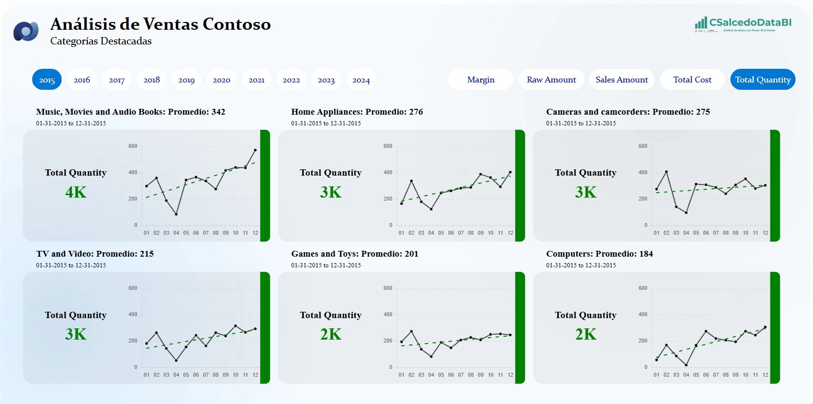

# Multiples Tarjetas

Ejemplo de Deneb (Vega-Lite) para Power BI. Todavía no tiene el spec publicado como JSON suelto: por ahora vive dentro del informe de Power BI de esta carpeta.

## Archivos

- [`Files/Explorador_de_KPIs_por_Categoria.pbix`](Files/Explorador_de_KPIs_por_Categoria.pbix)

> **Pendiente:** extraer el spec del informe y publicarlo como `.json` para poder copiarlo sin abrir el `.pbix`.

## Contacto

- **Correo:** [contacto@csalcedodatabi.com](mailto:contacto@csalcedodatabi.com)
- **LinkedIn:** [Cristobal Salcedo](https://www.linkedin.com/in/cristobal-salcedo)
- **Galería completa:** [csalcedodatabi.com/deneb](https://csalcedodatabi.com/deneb)

## Licencia

MIT — puedes usar, copiar y adaptar esta plantilla citando la autoría.
