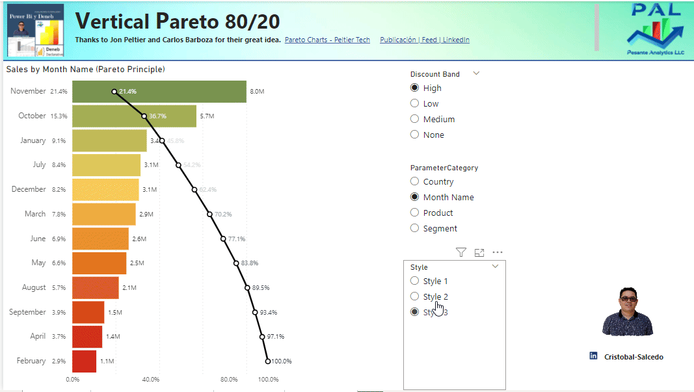

# 🎨 PowerBI-Deneb | Advanced Vega-Lite Visualizations for Power BI

[](https://github.com/CSalcedoDataBI/PowerBI-Deneb)
[](https://github.com/CSalcedoDataBI/PowerBI-Deneb)
[](LICENSE)
[](https://deneb-viz.github.io/)
[](https://www.youtube.com/@CSalcedoDataBI)

> **Premium collection of 9+ production-ready Deneb visualizations** using Vega & Vega-Lite for Power BI. Copy-paste templates, live demos, and complete documentation.

---

## 📖 Table of Contents

- [✨ What's Inside](#-whats-inside)
- [🚀 Quick Start](#-quick-start)
- [📚 Visualization Gallery](#-visualization-gallery)
- [💻 How to Use](#-how-to-use)
- [📥 Download & Import](#-download--import)
- [🎬 Video Tutorials](#-video-tutorials)
- [🤝 Contributing](#-contributing)
- [❓ FAQ](#-faq)

---

## ✨ What's Inside

This repository contains **production-ready Deneb templates** for Power BI with:

✅ **9+ custom visualizations** — Bars, Pareto, Scatter, Regressions  
✅ **Cross-filtering & highlighting** — Interactive dashboards out-of-the-box  
✅ **Parameter controls** — Dynamic axis alignment, color schemes  
✅ **Complete JSON templates** — Copy-paste into Deneb editor  
✅ **Example .pbix files** — Download & explore immediately  
✅ **Video tutorials** — Learn step-by-step on YouTube  

---

## 🚀 Quick Start

### 1️⃣ **Choose a Template**

Browse the `/` root directory for folders like:
- `Barras_Eje_Dinamico/` — Bar charts with dynamic axis alignment
- `Diagramas_Pareto/` — Pareto 80/20 principle visualizations
- `Dispersion_Etiquetados/` — Scatter plots with labeling
- `Dispersion_Regresion/` — Regression analysis visualizations

### 2️⃣ **Download the .pbix Example**

Each folder contains:
```
📁 Visualization_Name/
├── README.md                 ← Full documentation
├── Files/
│   ├── visualization.pbix    ← Download this!
│   ├── demo.gif              ← See it in action
│   └── template.json         ← JSON schema
```

### 3️⃣ **Import into Power BI**

1. Open Power BI Desktop
2. Open the `.pbix` file (or create a new report)
3. Insert → Deneb visual
4. Copy the JSON template from `template.json`
5. Load your own data → Done! ✅

### 4️⃣ **Customize**

- Change colors in the `config` → `mark` sections
- Adjust font sizes, opacity, spacing
- Add your own fields (replace `__0__`, `__1__` with your column names)

---

## 📚 Visualization Gallery

### 📊 1. **Barras con Alineación Dinámica** (Dynamic Bar Alignment)

**Use Case:** Toggle between left-aligned and right-aligned bar labels with a parameter.


**Features:**
- Parameter-driven label positioning
- Real-time axis switching
- Responsive sizing

📖 **[View Full Docs →](Barras_Eje_Dinamico/README.md)**

---

### 📈 2. **Gráfico de Pareto Vertical** (Pareto 80/20)

**Use Case:** Identify the 20% of products driving 80% of revenue.



**Features:**
- Cumulative percentage line
- Color-coded zones (80%, 20%)
- Sorted by impact
- Tooltip summary

📖 **[View Full Docs →](Pareto_Verticales/README.md)**

---

### 🎯 3. **Gráfico de Dispersión con Regresión** (Scatter + Regression)

**Use Case:** Show correlation between two metrics with trend line.


**Features:**
- Linear regression line
- Individual point highlighting
- Correlation coefficient display
- Cross-filtering support

📖 **[View Full Docs →](Dispersi%C3%B3n_Regresi%C3%B3n/README.md)**

---

### 🏷️ 4. **Dispersión con Etiquetas** (Labeled Scatter)

**Use Case:** Bubble chart showing product names, sizes, and relationships.


**Features:**
- Smart label positioning
- Bubble sizing by measure
- Color by category
- Cross-filtering active

📖 **[View Full Docs →](Dispersi%C3%B3n_Etiquetados/README.md)**

---

### 📊 5. **Gráficos de Barras Adaptables** (Responsive Bars)

**Use Case:** Bars that scale to container size with no manual resizing.


**Features:**
- Container-aware sizing
- Responsive padding
- Mobile-friendly
- Touch support

📖 **[View Full Docs →](Gr%C3%A1ficos_Barras_Adaptables/README.md)**

---

## 💻 How to Use

### **Option A: Copy-Paste JSON (Fastest)**

1. Open [Barras_Eje_Dinamico/Files/template.json](Barras_Eje_Dinamico/Files/)
2. Copy all JSON content
3. In Power BI:
   - Insert → **Deneb**
   - Paste JSON into editor
   - Map your fields
   - ✅ Done!

### **Option B: Download .pbix Example (Easiest)**

1. Navigate to any visualization folder (e.g., `Barras_Eje_Dinamico/`)
2. Download the `.pbix` file from `Files/`
3. Open in Power BI Desktop
4. Replace sample data with your own
5. ✅ Ready to go!

### **Option C: Clone Repository (Power Users)**

```bash
git clone https://github.com/CSalcedoDataBI/PowerBI-Deneb.git
cd PowerBI-Deneb
```

Then use any `.pbix` or `.json` directly.

---

## 📥 Download & Import

| Visualization | Download | JSON Template |
|---|---|---|
| 📊 Dynamic Bars | [.pbix](Barras_Eje_Dinamico/Files/) | [template.json](Barras_Eje_Dinamico/Files/template.json) |
| 📈 Pareto 80/20 | [.pbix](Diagramas_Pareto/FIles/) | [template.json](Diagramas_Pareto/FIles/template.json) |
| 🎯 Scatter Regression | [.pbix](Dispersi%C3%B3n_Regresi%C3%B3n/Files/) | [template.json](Dispersi%C3%B3n_Regresi%C3%B3n/Files/template.json) |
| 🏷️ Labeled Scatter | [.pbix](Dispersi%C3%B3n_Etiquetados/Files/) | [template.json](Dispersi%C3%B3n_Etiquetados/Files/template.json) |
| 📊 Adaptive Bars | [.pbix](Gr%C3%A1ficos_Barras_Adaptables/) | [template.json](Gr%C3%A1ficos_Barras_Adaptables/) |

---

## 🎬 Video Tutorials

Learn how to build and customize these visualizations:

- 🎥 **[Deneb Demo 2 — Dynamic Bar Chart](https://youtu.be/Doj-HLJn0Pc)** — Top N, Pareto 80/20 and dynamic parameters
- 🎥 **[Visual Top N + Pareto 80/20](https://youtu.be/YmIHZZX9S5M)** — Fully interactive, without complex DAX
- 🎥 **[Advanced Cross-Filtering in Deneb](https://youtu.be/t6uVu9l4hjE)** — Selection and cross-filter from a Vega spec

> Videos are in Spanish.

→ **[Subscribe for more](https://www.youtube.com/@CSalcedoDataBI)**
→ **[Browse the template gallery](https://csalcedodatabi.com/deneb/)** at csalcedodatabi.com — each template with its Vega-Lite spec ready to copy and a "how to use it in Power BI" walkthrough (in Spanish).

---

## 🤝 Contributing

Found a bug? Have an improvement? We welcome contributions!

### How to Contribute

1. **Fork** this repository
2. **Create a branch:** `git checkout -b feature/your-visualization`
3. **Commit changes:** `git commit -m "Add: new awesome visualization"`
4. **Push & open a Pull Request:** `git push origin feature/your-visualization`

### Guidelines

- Include a **README.md** in your visualization folder
- Provide a **.pbix example** file
- Add a **.gif or screenshot** showing the visualization
- Include the **JSON template** for copy-paste
- Document any **custom parameters**

---

## ❓ FAQ

### **Q: Do I need Deneb installed?**
**A:** Yes. [Install Deneb from AppSource (free)](https://deneb-viz.github.io/).

### **Q: Can I modify the templates?**
**A:** Absolutely! Each template is fully open and customizable. The MIT license allows modifications for personal and commercial use.

### **Q: Do these work offline?**
**A:** Yes, Deneb is a custom visual installed in Power BI Desktop. No internet required after installation.

### **Q: Can I use these in Power BI Service?**
**A:** Yes, but only if Deneb is enabled by your Power BI Admin. Check with your organization.

### **Q: How do I change colors?**
**A:** Find the `config` → `mark` → `fill` section in the JSON and update hex color codes (e.g., `#FF0000` for red).

### **Q: Are there more visualizations coming?**
**A:** Yes! This repo is actively maintained. Star ⭐ to get updates.

---

## 📞 Support & Contact

**Have questions?**

- 📧 **Email:** [contacto@csalcedodatabi.com](mailto:contacto@csalcedodatabi.com)
- 💼 **LinkedIn:** [Cristobal Salcedo](https://www.linkedin.com/in/cristobal-salcedo)
- 📘 **Facebook:** [CSalcedoDataBI](https://www.facebook.com/CSalcedoDataBI)
- 📺 **YouTube:** [CSalcedoDataBI](https://www.youtube.com/@CSalcedoDataBI)

---

## 📄 License

MIT License — see [LICENSE](LICENSE) for details.

Feel free to use these templates for **personal and commercial projects** without attribution (though it's appreciated! 😊).

---

## 🌟 Show Your Support

If these visualizations help your dashboards shine, please:

⭐ **Star this repository** — It helps others discover this resource  
🔗 **Share with your team** — Spread the knowledge  
💬 **Leave feedback** — Tell us what you'd like next  

---

<div align="center">

**Made with ❤️ by [Cristobal Salcedo](https://www.csalcedodatabi.com)**

**Powered by [Deneb](https://deneb-viz.github.io/) | Built with [Vega](https://vega.github.io/) & [Vega-Lite](https://vega.github.io/vega-lite/)**

</div>
